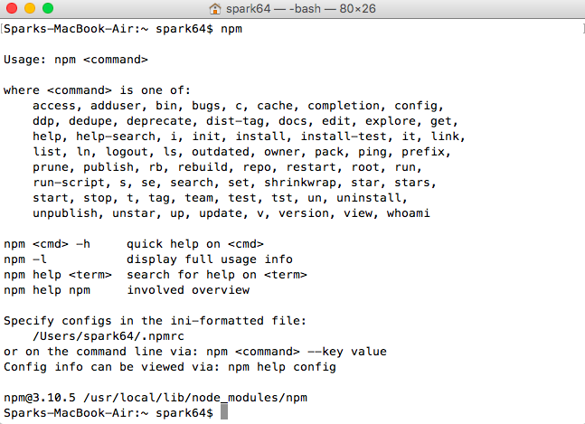
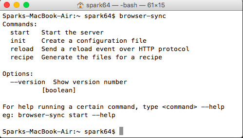
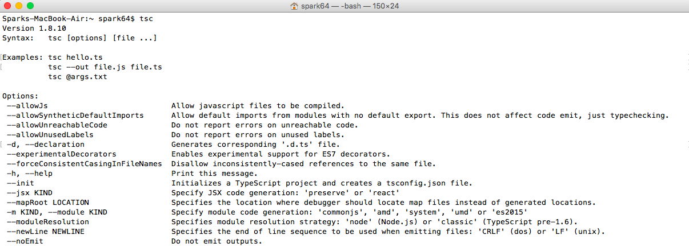
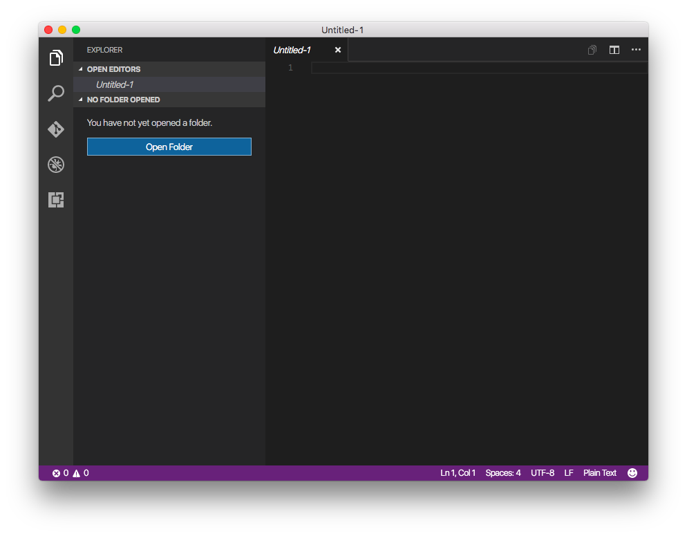
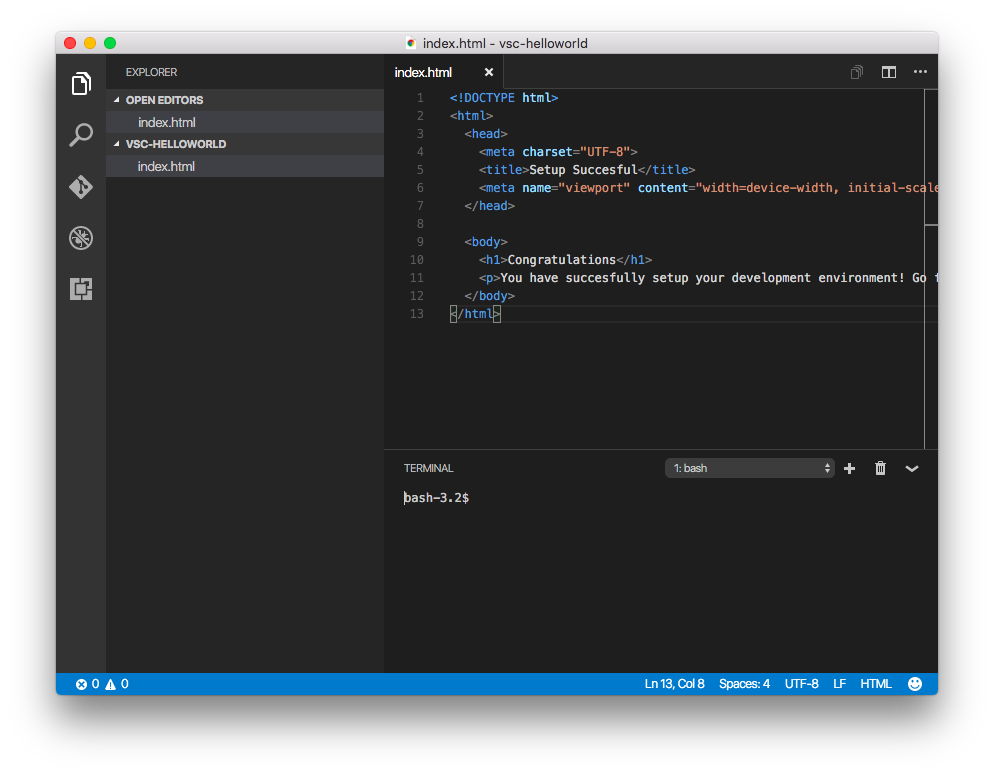
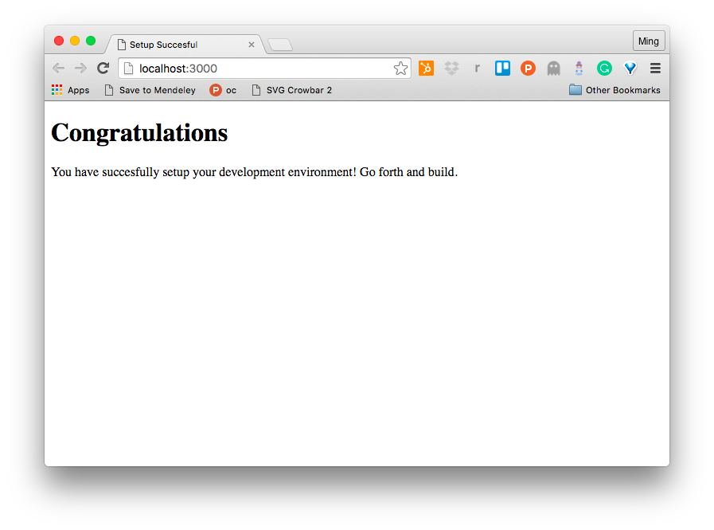

# 2. Development Environment
## Introduction
Before beginning any development, you need to set up your environment with the appropriate tools and software. In frontend web development, there is a huge range to choose from. For this course, we will be using the following:

### Visual Studio Code
Visual Studio Code is an open source, lightweight text editor with support for a wide variety of programming languages and frameworks. Popular alternatives you may have heard of are Sublime and Atom.

### Node.js
Node.js is a javascript runtime environment. Although we won't be doing any Node.js development, it does include a very popular package manager called **npm**. We will be using npm to install packages, including BrowserSync and TypeScript. 

### BrowserSync
To test your website, you will need a web server to host your files. Fortunately, you do not require a full-blown Apache web server for development and testing. BrowserSync allows you to create a web server quickly to test your website locally. Additionally, it supports live reloading. In other words, when you change something, it will instantly reload the browser to reflect the changes. Live reloading is useful for testing different styles, layouts, etc. 

## Learning Outcomes
* Setup a web development environment
* Install packages using Node.js
* Test website using BrowserSync

## Bootcamp Resources
* Slide Deck: [Download](https://1drv.ms/p/s!AhUTdgNym7JMjCRPvv07X8jIGAV6)
* Video: Coming soon

## Tutorial 1: Installation
### Setting up Visual Studio Code
Download and install Visual Studio Code on your machine here [Download Link](https://code.visualstudio.com/).

If you are having trouble installing it, the guide can be found [here](https://code.visualstudio.com/docs/setup/setup-overview).

### Setting up Node.js
Download and install Node.js from here [Download Link](https://nodejs.org/en/download/).

Once the installation is complete, open up Command Line (Windows) or Terminal (Mac) and run the following command:

```
npm
```

If everything was successful, you should get an output similar to this. Note that if you are on Windows, you may need to restart your computer for this to work. 



### Setting up BrowserSync
To setup BrowserSync, simply run the following command in Command Line (Windows):

```
npm install -g browser-sync
```

`npm install` calls the node package manager to install a package, `-g` tells it to install it globally so you can 
run it in any directory, and `browser-sync` is the name of the package. 

If you are using Mac, you may need to add `sudo` to the front of the command if you are getting permission errors:

```
sudo npm install -g browser-sync
```

If the installation was successful, you should be able to run the following command:

```
browser-sync
```

and get the following output:



### Setting up TypeScript
The process is almost the same as installing BrowserSync.
To setup TypeScript on Windows, run the following command in Command Line:

```
npm install -g typescript
```

Again if you are using Mac, you will need to add `sudo`:

```
sudo npm install -g typescript
```

If the installation was successful, you should be able to run the following command:

```
tsc
```


and get the following output:


## Tutorial 2: Testing your first project
We are going to run a simple website using our newly setup environment. 

1. Open Visual Studio Code
2. Expand the explorer tab on the side and click "Open Folder"

3. Create a new folder and select the folder to open
4. Create a new file in the folder and name it index.html

5. Paste in the following HTML code to the new file

```html
<!DOCTYPE html>
<html>
  <head>
    <meta charset="UTF-8">
    <title>Setup Succesful</title>
    <meta name="viewport" content="width=device-width, initial-scale=1">
  </head>

  <body>
    <h1>Congratulations</h1>
    <p>You have succesfully setup your development environment! Go forth and build.</p>
  </body>
</html>
```

6. Save the file. 
7. Open up the integrated terminal by going to View -> Integrated Terminal

8. Run the following command:
```
browser-sync start --server --files "*"
```

`browser-sync start` starts BrowserSync, `--server` runs a local server using your current directory as the root and `--files '*'` tells BrowserSync the files it should watch for changes ('*' denotes watching all files). 

9. Your browser should open up, and the page should show. Try making a change to the html file, save it, and the page should reload automatically. 



10. To stop the server, go to the console, and press `ctrl+c`.

For more information about the avaiable commands, please see the documentation [here](https://www.browsersync.io/docs/command-line).


### Extra for Experts
#### sudo on Mac
If you are using Mac, it is not recommended that you use `sudo` to install global packages. It was used here for the purpose of simplicity.

To fix this once and for all, follow this [tutorial](https://docs.npmjs.com/getting-started/fixing-npm-permissions).

#### BrowserSync options
If your files are contained in a different directory, specify the relative path after `--server` and files after `--files`, for example:
```
browser-sync start --server 'app' --files '[app\*.html, app\styles\*.css]'
```
This command will serve files from the app\ folder, and watch all html files in the app\ folder and css files in the app\styles\ folder
### Extra Learning Resources
* [What is npm?](https://docs.npmjs.com/getting-started/what-is-npm)
* [BrowserSync documentation](https://www.browsersync.io/docs/command-line)